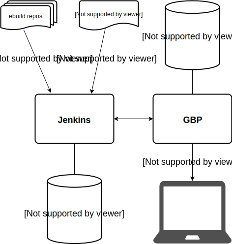

# Gentoo Build Publisher

## Introduction

Gentoo Build Publisher (GBP) uses [continuous
integration](https://en.wikipedia.org/wiki/Continuous_integration) and other
tools to deliver successful, consistent "builds" for a single machine or
multiple heterogeneous Gentoo machines.

In case you didn't know, [Gentoo Linux](https://www.gentoo.org/) is a
source-based rolling-release meta-distribution that you can twist and mold
into pretty much anything you like. That's just a verbose way of saying Gentoo
is awesome.

If you run a Gentoo system, say a laptop, you may be updating your system
using the standard `emerge --sync` followed by a world update. This pulls in
the latest ebuilds from the Gentoo repo and if there are any updates
applicable to your system then they get built on your system.

Except sometimes they don't.

Sometimes builds fail. Sometimes `USE` flags need to be changed. Sometimes
there's an update to a piece of software that is buggy and you want to revert.
Sometimes a build takes a long time and you don't want to wait.

Well since Gentoo is the distribution you build yourself, CI/CD seems like a
natural fit. Enter Gentoo Build Publisher.

Gentoo Build Publisher combines a repo/overlay server, basic configuration
management, and binary package server (binhost) for complete and atomic
builds.  Successful builds performed by Jenkins are served by GBP where client
machines sync from.

## Procedure

* Build a Gentoo Build Publisher instance. Refer to the [Install
  Guide](https://github.com/enku/gentoo-build-publisher/wiki/Install-Guide).
* Create "machines" and "repos" jobs in Jenkins.  For example `gbp addrepo
  gentoo https://anongit.gentoo.org/git/repo/gentoo.git; gbp addmachine base
  https://github.com/enku/gbp-machines.git` Use [the gbp-machines
  repo](https://github.com/enku/gbp-machines) as a starting point. This can
  also be done manually within the Jenkins UI.
* Once a Jenkins job has been pulled by Gentoo Build Publisher it can be
  published so that actual machines can use it (e.g. rsync for repos, http for
  binpkgs).  Use the CLI (`gbp publish`) to publish a pulled build.
* If the job fails, it will not be pulled.
* Your real machine, for example, `base`, syncs from, `rsync://gbp/repos/base/gentoo`.
  You can dynamically acquire the `repos.conf` file from
  `https://gbp/machines/base/repos.conf` and the `binrepos.conf` from
  `https://gbp/machines/base/binrepos.conf`.

# CLI

The [command-line interface](https://github.com/enku/gbpcli#readme) can
inspect, publish, pull, schedule builds and more.

# Articles

Below are some articles that explain some aspects of Build Publisher in
detail.

- [Introducing Gentoo Build Publisher](https://lunarcowboy.com/introducing-gentoo-build-publisher.html): June 2021
- [Exploring the Gentoo Build Publisher Dashboard](https://lunarcowboy.com/exploring-the-gentoo-build-publisher-dashboard.html): November 2021
- [Getting failure logs](https://lunarcowboy.com/gentoo-build-publisher-getting-failure-logs.html): April 2022
- [Installing Gentoo Build Publisher](https://lunarcowboy.com/installing-gentoo-build-publisher.html) August 2022
- [Rolling Back a Rolling Release with Gentoo Build Publisher](https://lunarcowboy.com/rolling-back-a-rolling-release-with-gentoo-build-publisher.html): September 2022
- [Bisecting GBP Builds to Find a Bad Package](https://lunarcowboy.com/bisecting-gbp-builds-to-find-a-bad-package.html): April 2023
- [Gentoo Build Publisher: Pro-Tip: Purging a Machine that is Disabled on Jenkins](https://lunarcowboy.com/gentoo-build-publisher-pro-tip-purging-a-machine-that-is-disabled-on-jenkins.html): August 2023
