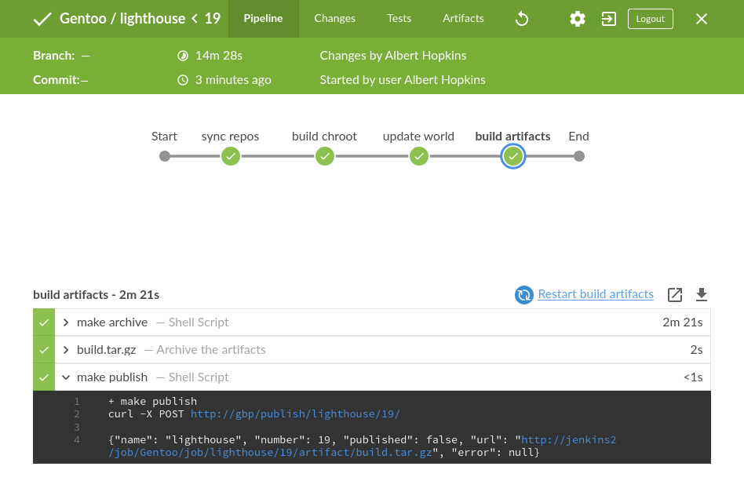

<p align="center">

</p>

# Gentoo Build Publisher

## Introduction

Right now for all my [Gentoo](https://www.gentoo.org) systems (physical, VMs,
and containers) I have [Jenkins](https://www.jenkins.io) builds that creates
binary packages for them.  The actual builds are done in
[buildah](https://buildah.io/) containers.  The builds are triggered by
periodically polling the Gentoo portage git repo, related overlays and the
machine's "build" repo itself.  The buildah containers that build the packages
have their binary packages exposed by a web service container (gentoo build
publisher) and the portage tree is exposed via rsync on the host. When I want
to update my system it's

```bash
# emerge --sync
# emerge --deep --upgrade --ask --newuse @world
```

The `/etc/portage` and `/var/lib/portage` directories for each system are also
kept in version control, which is tracked by Jenkins. So e.g. if I want to add
a package or change a use flag, I do so in the repo, push it and Jenkins picks
up the change and creates a new build job.

As Jenkins creates artifacts of all the successful builds those artifacts get
published to gentoo build publisher to host them.  This is done for both binary
packages and the portage tree. So when you sync/update from GBP you're always
getting a stable upgrade.  Even nicer, since successful all artifacts are kept
you can go back to a previous succesful build and still have the portage
snapshot and binary packages from that build.

Eventually I'd like to automate all this.  For example I want to stand up a new
system. I go to a web ui, give it a profile name and click "build". It creates
a new machine profile/repo pushes it and then creates a new job in Jenkins to
build from it. I can then build a new system from that.


## Procedure

I'm not going to go into all the details now as it's pretty complicated and may
change.  But basically the gist is this:

* You need a Jenkins instance
* Create "repos" jobs in Jenkins.  These jobs should poll their respective
  repos (e.g. [gentoo](https://anongit.gentoo.org/git/repo/sync/gentoo.git) and
  publish archive an artifact (say `gentoo-repo.tar.gz`) from it.
* For your machine type, say database, you create a Jenkins job. This job
  should create a container from a
  [stage3](https://hub.docker.com/r/gentoo/stage3) image (I actually use the
  systemd image).  Then it could add the artifacts from the repos above into
  the container's `/var/db/repos` directory.  You also need your machine's
  "profile" in a repo. This should be the repo that's pulled by your Jenkins
  job.  Unpack that as well in your Jenkins workspace. The "profile" should
  contain such things as your machine's `/etc/portage` and `/var/lib/portage`
  contents.
* Your Jenkins job then uses `buildah run` to emerge world the container.
* Upon success the job should pack the `repos` and `binpkgs` into a tar archive
  (`build.tar.gz`).
* Your job should have a post-build task that calls the Gentoo Build Publisher.
  It will then pull the specified archive and publish it (e.g. rsync for repos,
  http for binpkgs.
* If the job fails, it does not be published. Your last successful build stays
  current.
* Your real machine syncs from, e.g. rsync://gbp/repos/<machine>/ and pulls binary
  packages from http://gbp/binpkgs/<machine>/

I have a git repo called `machines` that contains the profiles for all the
machines whose builds I want to push to the publisher.  See the
[contrib/machines](contrib/machines) directory for an example.
