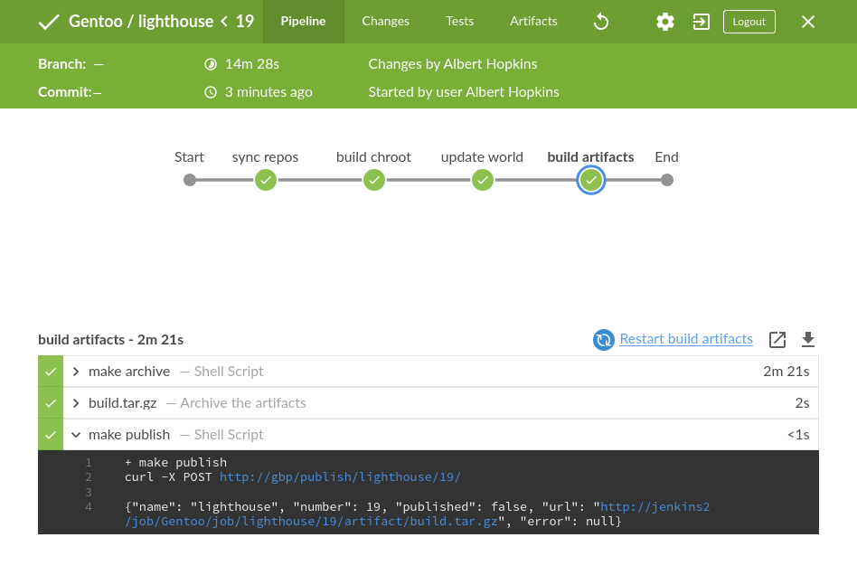
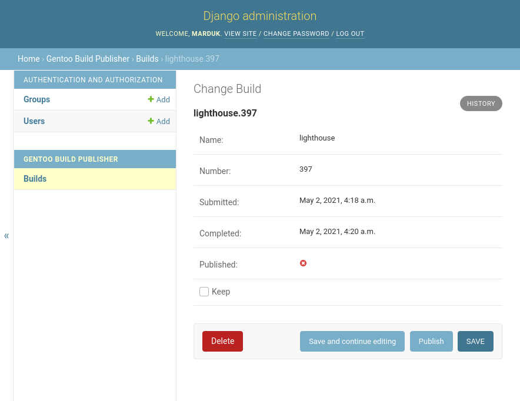

<p align="center">

</p>

<p align="center">

</p>

# Gentoo Build Publisher

## Introduction

The idea is to combine best practices with CI/CD and other tools to deliver
successful, consistent "builds" to your Gentoo machine(s).

In case you didn't know, [Gentoo Linux](https://www.gentoo.org/) is a
source-based rolling-release meta-distribution that you can twist and mold into
pretty much anything you like. That's just a verbose way of saying Gentoo is
awesome.

If you run a Gentoo system, say a laptop, and you may be updating your system
using the standard `emerge --sync` followed by a world update.  This pulls in
the latest ebuilds from the Gentoo repo and if there are any updates applicable
to your system then they get built on your system.

Except sometimes they don't.

Sometimes builds fail. Sometimes `USE` flags need to be changed. Sometimes
there's an update to a piece of software that is buggy and you want to revert.
Sometimes a build takes a long time and you don't want to wait.

Well since Gentoo is the distribution you build yourself, CI/CD seems like a
natural fit. For years I would have a Jenkins instance that ran "builds" for my
Gentoo systems. Each Gentoo job consisted of a systemd container.  These
containers were "shadows" of my real systems and the Jenkins job would
bind-mount a portage repo and binpkgs directory inside and do a world update.
The binpkgs directory was shared via nginx and the portage tree was shared via
rsync. This worked well but there were a few annoying issues:

* The job that updated the portage tree and the job that updated the binpkgs
  were not always in sync.  If a world update took 5 hours, for example, the
  hourly portage tree poller might have synced 5 times.  Moreover if I sync
  against my "real" machine hours later it may be even more out of sync.

* It's certainly possible that my "real" machines could sync while the Jenkins
  job is still building causing any not-yet-built binpkgs to want to build on
  my real machine.

* If the build failed in Jenkins for any reason when I go to sync from my real
  machine I will have a system in a inconsistent state.  Likely packages will
  want to build on my real machine and will fail again.

* Although possible with a little elbow grease, there's no easy way to revert
  back to a previous build.

* If I changed a config (USE flags, world file, etc.) on my real machine I'd
  have to find a way of getting the change into the shadow container.

The last issue I later solved by having my the `/etc/portage` and
`/var/lib/portage` of all my real machines in version control and having the
shadows pull from a repo.

Most, if not all, of the other issues stem from the fact that I was not taking
advantage of a fundamental CI/CD feature: build artifacts. The portage tree and
binpkgs were "live".  They changed independent of the "build" and if a build
failed the partially-completed parts were always shared. I concluded that the
thing that created the builds, Jenkins, needed to archive successful builds and
there needs to be another thing that only publishes the builds.

Enter Gentoo Build Publisher.

Gentoo Build Pubisher is the combination of an rsync server (for ebuild repos
and machine configs) and HTTP server (for binpkgs) for successful builds.  For
Jenkins it is a gateway to publish builds. For my real machines it the source
for repo syncs and binpkgs.


## Procedure

* You need a Jenkins instance
* Create "repos" jobs in Jenkins.  These jobs should poll their respective
  repos (e.g. [gentoo](https://anongit.gentoo.org/git/repo/sync/gentoo.git) and
  publish archive an artifact (say `gentoo-repo.tar.gz`) from it.
* For your machine type, say database, you create a Jenkins job. This job
  should create a container from a
  [stage3](https://hub.docker.com/r/gentoo/stage3) image (I actually use the
  systemd image).  Then it could add the artifacts from the repos above into
  the container's `/var/db/repos` directory.  You also need your machine's
  "profile" in a repo. This should be the repo that's pulled by your Jenkins
  job.  Unpack that as well in your Jenkins workspace. The "profile" should
  contain such things as your machine's `/etc/portage` and `/var/lib/portage`
  contents. If this all sounds rather complicated, check the `contrib`
  directory of the gentoo-build-publisher source for a (hopefully) working
  example.
* Your Jenkins job then uses `buildah run` to emerge world the container.
* Upon success the job should pack the `repos` and `binpkgs` and other config
  into a tar archive
  (`build.tar.gz`).
* Your job should have a post-build task that calls the Gentoo Build Publisher.
  It will then pull the specified archive.

* Once a Jenkins job has been pulled by Gentoo Build Publisher it can be
  published so that actual machines can use it (e.g. rsync for repos, http for
  binpkgs).

* If the job fails, it will not be pulled.

* Your real machine syncs from, e.g. rsync://gbp/repos/<machine>/ and pulls binary
  packages from https://gbp/binpkgs/<machine>/

<p align="center">

</p>

I have a git repo called `machines` that contains the profiles for all the
machines whose builds I want to push to the publisher.  See the
[contrib/machines](contrib/machines) directory for an example.

My Jenkins job does not publish a build by default. I (can) later publish the
build so that my machines can consume them.  There is a REST interface for
doing such tasks and I'm currently working on a command-line interface.

```bash
$ gbp list babette
[  ]   104 04/25/21 06:51:19
[  ]   109 04/30/21 07:27:04
[PN]   132 05/21/21 11:27:50
[  ]   142 05/31/21 07:00:30
[  ]   143 06/01/21 17:51:28
[  ]   144 06/02/21 06:49:41
[  ]   145 06/03/21 09:49:21
[  ]   146 06/04/21 06:53:53
[  ]   147 06/05/21 06:49:36

$ gbp show babette 132
Build: babette/132
Submitted: Fri May 21 11:27:50 2021 -0700
Completed: Fri May 21 11:28:44 2021 -0700
Published: True

  This is where babette is now

$ gbp publish babette 147
```

In the above example, the `PN` output for build `132` signifies that this build
is currently published (`P`) and there is a user note for that build (`N`).
The user note can be shown with the `gbp show` command.  I will soon implement
a `gbp diff` command so that you can see the differences between two builds
(packages added/changed/removed)
