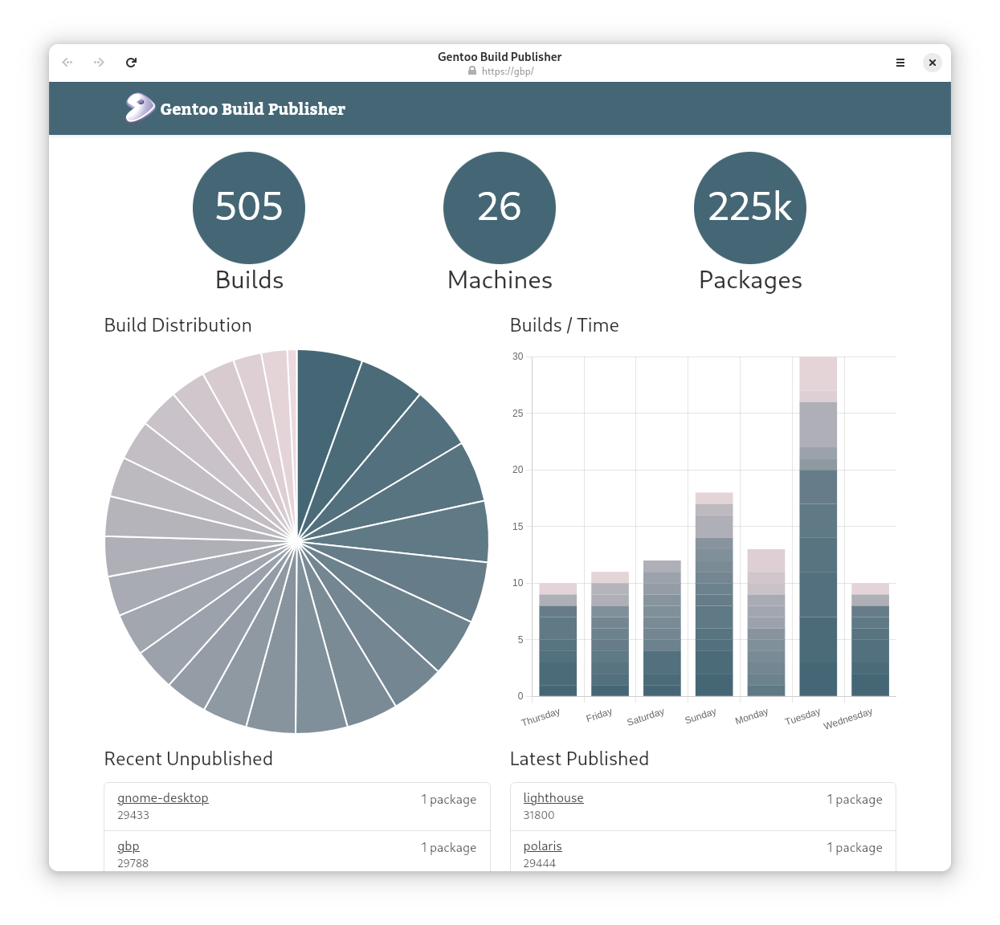

<p align="center">

</p>

# Gentoo Build Publisher

## Introduction

The idea is to combine best practices with [continuous
integration](https://en.wikipedia.org/wiki/Continuous_integration) and other
tools to deliver successful, consistent "builds" to your Gentoo machine(s).

In case you didn't know, [Gentoo Linux](https://www.gentoo.org/) is a
source-based rolling-release meta-distribution that you can twist and mold
into pretty much anything you like. That's just a verbose way of saying Gentoo
is awesome.

If you run a Gentoo system, say a laptop, you may be updating your system
using the standard `emerge --sync` followed by a world update.  This pulls in
the latest ebuilds from the Gentoo repo and if there are any updates
applicable to your system then they get built on your system.

Except sometimes they don't.

Sometimes builds fail. Sometimes `USE` flags need to be changed. Sometimes
there's an update to a piece of software that is buggy and you want to revert.
Sometimes a build takes a long time and you don't want to wait.

Well since Gentoo is the distribution you build yourself, CI/CD seems like a
natural fit. Enter Gentoo Build Publisher.

Gentoo Build Pubisher is the combination of an rsync server (for ebuild repos
and machine configs) and HTTP server (for binpkgs) for successful builds.  For
Jenkins it is a gateway to publish builds. For my real machines it the source
for repo syncs and binpkgs.


## Table Of Contents

- [Procedure](#procedure)
- [Software](#software)
- [Command Line Interface](#cli)
- [Articles](#articles)


## Procedure

* Build a Gentoo Build Publisher instance. Refer to the [Install
  Guide](docs/how-to-install.md).
* Create "machines" and "repos" jobs in Jenkins.  Use [the following git
  repo](https://github.com/enku/gbp-machines) as a starting point.
* Once a Jenkins job has been pulled by Gentoo Build Publisher it can be
  published so that actual machines can use it (e.g. rsync for repos, http for
  binpkgs).  Use the CLI (`gbp publish`) to publish a pulled build.
* If the job fails, it will not be pulled.
* Your real machine, e.g. `database`, syncs from, e.g.
  rsync://gbp/repos/database/ and pulls binary packages from
  https://gbp/binpkgs/database/

<p align="center">

</p>

I have a git repo called `machines` that contains the profiles for all the
machines whose builds I want to push to the publisher.  You can fork the
[gbp-machines](https://github.com/enku/gbp-machines) repo as a starting point.

My Jenkins job does not publish a build by default. I (can) later publish the
build so that my machines can consume them.  There is a GraphQL interface for
doing such tasks as well as a [command-line
interface](https://github.com/enku/gbpcli).

# Software

This project hosts the application called gentoo-build-publisher. Combined
with Jenkins, the above procedure,`rsyncd`, a web server to serve binary
packages (e.g. nginx) and a [command-line interface](#cli) you can get all the
advantages of a source-based Linux distribution like Gentoo combined with the
advantages of binary distros plus even more.

# CLI

The command-line interface can inspect, publish and pull builds:

```bash
$ gbp list babette
[ K  ]   104 04/25/21 08:51:19
[    ]   132 05/21/21 13:27:50
[*  N]   412 02/27/22 06:42:08
[*   ]   413 02/28/22 06:43:32
[*   ]   430 03/16/22 08:49:15
[*   ]   431 03/17/22 08:54:43
[*   ]   434 03/21/22 16:37:30
[*   ]   435 03/22/22 12:01:48
[* P ]   437 03/22/22 13:28:13
[*   ]   438 03/23/22 13:09:26

$ gbp status babette 412
Build: babette/412
BuildDate: Sun Feb 27 06:38:30 2022 -0500
Submitted: Sun Feb 27 06:42:08 2022 -0500
Completed: Sun Feb 27 06:45:00 2022 -0500
Published: no
Keep: no
Packages-built:
    app-text/opensp-1.5.2-r7

This is a build note.

$ gbp diff babette 437 438
diff -r babette/437 babette/438
--- a/babette/437 Tue Mar 22 13:28:13 2022 -0500
+++ b/babette/438 Wed Mar 23 13:09:26 2022 -0500
-app-admin/sudo-1.9.8_p2-1
+app-admin/sudo-1.9.8_p2-r1-1
-app-crypt/gnupg-2.2.34-1
+app-crypt/gnupg-2.2.34-r1-1
-dev-python/importlib_metadata-4.11.2-1
-dev-python/zipp-3.7.0-r1-1
-net-misc/curl-7.79.1-3
+net-misc/curl-7.79.1-r1-1

$ gbp publish babette 438
```

In the above example, the `* P` output for build `437` signifies that this
build is currently published (`P`) and there were packages built (`*`).  The
`N` for build `412` indicates a user note. The user note and packages built
can be shown with the `gbp status` command.  `gbp diff` shows the differences
between two builds (packages added/changed/removed). Builds are purged based
on how old they are, but you can mark builds to keep.  The `K` next to a build
means that it has been marked for keeping. To mark a build for keeping on the
command line, simply:

```bash
$ gbp keep babette 172
```

# Articles

Below are some articles I've written that explain some aspects of Build
Publisher in detail.

- [Introducing Gentoo Build Publisher](https://lunarcowboy.com/introducing-gentoo-build-publisher.html): June 2021
- [Exploring the Gentoo Build Publisher Dashboard](https://lunarcowboy.com/exploring-the-gentoo-build-publisher-dashboard.html): November 2021
- [Getting failure logs](https://lunarcowboy.com/gentoo-build-publisher-getting-failure-logs.html): April 2022
- [Installing Gentoo Build Publisher](https://lunarcowboy.com/installing-gentoo-build-publisher.html) August 2022
